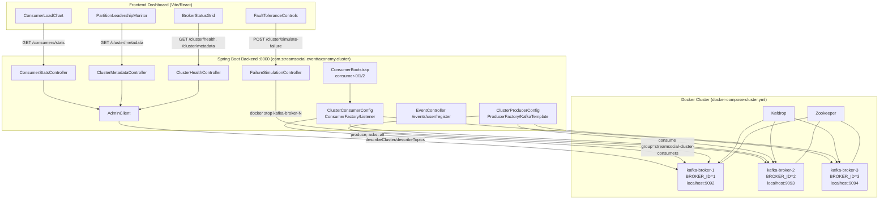
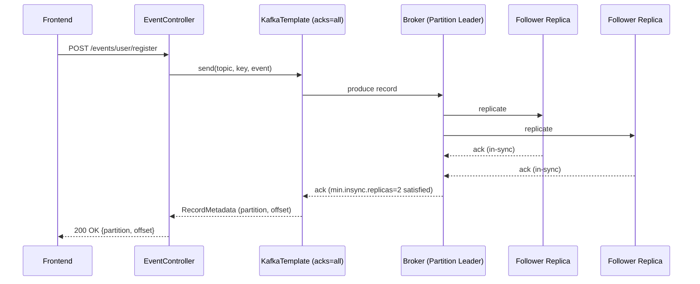
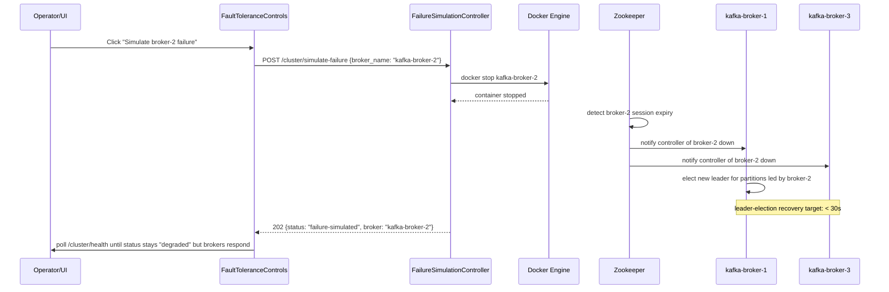

# Design Document: Kafka Cluster (Multi-Broker Upgrade)

## Overview

StreamSocial's Day 1 system (`day2/streamsocial-kafka/`) runs on a single Kafka broker: one Zookeeper node, one `cp-kafka` broker (`KAFKA_BROKER_ID=1`, replication factor 1), and Kafdrop for inspection, fronted by a Spring Boot backend (`com.streamsocial.eventtaxonomy`) and a Vite/React frontend. This is fine for demoing event taxonomy, but it has no redundancy: if the single broker goes down, the whole event pipeline stops.

This feature evolves that existing project into a production-style **3-broker Kafka cluster** with real replication (RF=3, min in-sync replicas=2), a cluster-aware Spring Kafka producer/consumer layer, REST APIs for cluster health/metadata/consumer-lag/fault-injection, and frontend dashboard panels for broker status, consumer load, partition leadership, and fault-tolerance testing. The change is additive and parallel to the existing single-broker setup: a new `docker-compose-cluster.yml`, new cluster-scoped config beans/controllers, and new dashboard components sit alongside (not replacing) the Day 1 code, so the existing `kafka` profile and single-broker demo continue to work unmodified.

## Existing System (Baseline)

```pascal
STRUCTURE ExistingSystem
  infra:
    zookeeper            (cp-zookeeper:7.4.0, port 2181)
    kafka (single)        (cp-kafka:7.4.0, container "streamsocial-kafka",
                            KAFKA_BROKER_ID=1, offsets RF=1,
                            advertised listener localhost:9092)
    kafdrop               (port 9000, brokerconnect kafka:29092)

  backend-java (com.streamsocial.eventtaxonomy):
    config/    CorsConfig, EventBusConfig, KafkaConfig, StaticResourceConfig, WebSocketConfig
    events/    BaseEvent, EventBus, EventType
    producer/  EventProducerService
    consumer/  EventConsumerService
    handlers/  FeedHandler, NotificationHandler
    controller/ EventController        (port 8080, /api/v1/events/*)
    websocket/ EventWebSocketHandler   (ws://localhost:8080/ws)
    dto/       UserRegistrationRequest, CreatePostRequest, LikePostRequest, ...
    profiles:  default = in-memory EventBus (Kafka autoconfig excluded)
               "kafka" = spring.kafka.bootstrap-servers=localhost:9092

  frontend (Vite/React, day2/streamsocial-kafka/frontend):
    App.jsx -> EventPublisher.jsx, EventDashboard.jsx
    talks to API_BASE=http://localhost:8080/api/v1/events, WS ws://localhost:8080/ws

  scripts: start.sh/stop.sh/verify.sh (single-broker docker-compose up/down)
END STRUCTURE
```

**Note on backend port**: the slide deck's prerequisites section references a demo app on port 3001 from a different repo/branch than the references section. This design treats **port 8000** as the authoritative cluster backend API port for build-verify flows (per slide 36 "build-verify"), consistent with the `curl http://localhost:8000/cluster/health` verification commands. Port 8080 remains the Day 1 single-broker backend; the cluster feature's backend process is a distinct run (or profile) that binds 8000. This is called out explicitly rather than silently resolved, since the two slides disagree.

## Architecture

### High-Level Component Diagram



### Sequence: Producer publish with cluster replication



### Sequence: Broker failure + auto-failover



## Components and Interfaces

### Component: Cluster Docker Compose (`docker-compose-cluster.yml`)

**Purpose**: Stand up Zookeeper + 3 Kafka brokers + Kafdrop as an isolated cluster, independent of the existing single-broker `docker-compose.yml`.

**Responsibilities**:
- Coordinate broker membership/leader election via Zookeeper (not KRaft, per training scope)
- Expose each broker on a distinct host port (9092/9093/9094) so the Spring Kafka client can reach any broker directly
- Apply production-style `server.properties` tuning to each broker
- Give Kafdrop visibility into all 3 brokers

### Component: ClusterProducerConfig (Spring Kafka)

**Purpose**: Configure a `ProducerFactory`/`KafkaTemplate` bean that talks to all 3 brokers with durability-first settings (`acks=all`, `retries=10`), and pre-declare topics with 9 partitions / RF=3.

**Interface**:
```java
public interface ClusterTopicProvisioner {
    NewTopic ensureTopic(String topicName);
}
```

**Responsibilities**:
- Bootstrap-servers = `localhost:9092,localhost:9093,localhost:9094`
- `acks=all`, `retries=10` for at-least-once durability across broker loss
- Register `NewTopic` beans with `partitions=9`, `replicationFactor=3` (matches slide's leadership layout reference: broker-1/2/3 each lead a subset of the 9 partitions across `user_action`, `content_interaction`, `system_event`)

### Component: ClusterConsumerConfig + ConsumerBootstrap

**Purpose**: Configure a cluster-aware `ConsumerFactory`/`ContainerFactory` and start multiple consumer instances in the same group to demonstrate dynamic partition rebalancing.

**Responsibilities**:
- Bootstrap-servers = same 3 brokers, `group-id=streamsocial-cluster-consumers`, `auto-offset-reset=latest`, `enable-auto-commit=true`
- On `ApplicationReadyEvent`, start 3 named consumer instances (`consumer-0`, `consumer-1`, `consumer-2`) in the same group so partitions rebalance across them automatically
- Track per-consumer assigned-partition counts and last-seen offsets in memory for `/consumers/stats`

### Component: AdminClient-backed Cluster Introspection

**Purpose**: Provide read-only cluster state used by both health checks and the frontend dashboard.

**Interface**:
```java
public interface ClusterInspector {
    ClusterHealth health();
    ClusterMetadata metadata();
    List<ConsumerGroupStat> consumerStats(String groupId);
}
```

### Component: FailureSimulationController

**Purpose**: Accept an operator-triggered "simulate failure" request and stop the named broker container, to exercise fault tolerance without a human running `docker stop` by hand.

**Responsibilities**:
- Validate `broker_name` is one of the 3 known cluster containers (`kafka-broker-1|2|3`)
- Shell out to `docker stop <broker_name>` (or `docker restart` for recovery) via `ProcessBuilder`
- Return `202 Accepted` immediately; actual cluster state converges asynchronously and is observed via `/cluster/health`

### Component: Frontend Cluster Dashboard

**Purpose**: Extend the existing Vite/React app with cluster-observability panels, added alongside (not replacing) `EventDashboard`/`EventPublisher`.

**Responsibilities**:
- `BrokerStatusGrid` — polls `/cluster/health` + `/cluster/metadata`, renders 3 broker cards (up/down, partition leader count)
- `ConsumerLoadChart` — polls `/consumers/stats`, renders per-consumer-instance event/partition distribution
- `FaultToleranceControls` — buttons per broker to POST `/cluster/simulate-failure`, plus a "restart" action
- `PartitionLeadershipMonitor` — visualizes which broker currently leads which partition/topic, refreshed from `/cluster/metadata`

## Data Models

```java
// Broker-level config (mirrors docker-compose environment block)
public record BrokerConfig(
    int brokerId,                 // 1, 2, or 3
    String advertisedListener,    // e.g. "localhost:9092"
    int defaultReplicationFactor, // 3
    int minInSyncReplicas,        // 2
    int numNetworkThreads,        // 8
    int numIoThreads,             // 16
    int socketSendBufferBytes,    // 102400
    int socketReceiveBufferBytes  // 102400
) {}

public record ClusterHealth(
    int brokerCount,
    int topicCount,
    String status // "healthy" if brokerCount >= 2 else "degraded"
) {}

public record BrokerNode(
    int id,
    String host,
    int port,
    boolean isController
) {}

public record PartitionLeaderInfo(
    String topic,
    int partition,
    int leaderBrokerId,
    List<Integer> replicaBrokerIds,
    List<Integer> inSyncReplicaBrokerIds
) {}

public record ClusterMetadata(
    List<BrokerNode> brokers,
    List<PartitionLeaderInfo> partitionLeaders
) {}

public record ConsumerGroupStat(
    String consumerId,     // "consumer-0" | "consumer-1" | "consumer-2"
    int assignedPartitions,
    long totalLag
) {}

public record ConsumerStatsResponse(
    String groupId,        // "streamsocial-cluster-consumers"
    List<ConsumerGroupStat> consumers
) {}

public record SimulateFailureRequest(
    String brokerName      // "kafka-broker-1" | "kafka-broker-2" | "kafka-broker-3"
) {}

public record SimulateFailureResponse(
    String status,         // "failure-simulated"
    String broker
) {}
```

**Validation rules**:
- `brokerName` in `SimulateFailureRequest` must match `^kafka-broker-[1-3]$`; anything else → `400 Bad Request`
- `ClusterHealth.status` is derived, never client-supplied: `"healthy"` iff `brokerCount >= 2`, else `"degraded"`
- Topic provisioning requests reject `replicationFactor > brokerCount` (cannot satisfy RF=3 with fewer than 3 live brokers)

## Low-Level Design

### Docker Compose: `docker-compose-cluster.yml`

```yaml
version: '3.8'

services:
  zookeeper:
    image: confluentinc/cp-zookeeper:7.4.0
    container_name: streamsocial-zookeeper-cluster
    ports:
      - "2181:2181"
    environment:
      ZOOKEEPER_CLIENT_PORT: 2181
      ZOOKEEPER_TICK_TIME: 2000

  kafka-broker-1:
    image: confluentinc/cp-kafka:7.4.0
    container_name: kafka-broker-1
    depends_on: [zookeeper]
    ports:
      - "9092:9092"
    environment:
      KAFKA_BROKER_ID: 1
      KAFKA_ZOOKEEPER_CONNECT: zookeeper:2181
      KAFKA_LISTENER_SECURITY_PROTOCOL_MAP: PLAINTEXT:PLAINTEXT,PLAINTEXT_HOST:PLAINTEXT
      KAFKA_LISTENERS: PLAINTEXT://0.0.0.0:29092,PLAINTEXT_HOST://0.0.0.0:9092
      KAFKA_ADVERTISED_LISTENERS: PLAINTEXT://kafka-broker-1:29092,PLAINTEXT_HOST://localhost:9092
      KAFKA_INTER_BROKER_LISTENER_NAME: PLAINTEXT
      KAFKA_DEFAULT_REPLICATION_FACTOR: 3
      KAFKA_MIN_INSYNC_REPLICAS: 2
      KAFKA_OFFSETS_TOPIC_REPLICATION_FACTOR: 3
      KAFKA_NUM_NETWORK_THREADS: 8
      KAFKA_NUM_IO_THREADS: 16
      KAFKA_SOCKET_SEND_BUFFER_BYTES: 102400
      KAFKA_SOCKET_RECEIVE_BUFFER_BYTES: 102400
      KAFKA_AUTO_CREATE_TOPICS_ENABLE: "true"

  kafka-broker-2:
    image: confluentinc/cp-kafka:7.4.0
    container_name: kafka-broker-2
    depends_on: [zookeeper]
    ports:
      - "9093:9093"
    environment:
      KAFKA_BROKER_ID: 2
      KAFKA_ZOOKEEPER_CONNECT: zookeeper:2181
      KAFKA_LISTENER_SECURITY_PROTOCOL_MAP: PLAINTEXT:PLAINTEXT,PLAINTEXT_HOST:PLAINTEXT
      KAFKA_LISTENERS: PLAINTEXT://0.0.0.0:29093,PLAINTEXT_HOST://0.0.0.0:9093
      KAFKA_ADVERTISED_LISTENERS: PLAINTEXT://kafka-broker-2:29093,PLAINTEXT_HOST://localhost:9093
      KAFKA_INTER_BROKER_LISTENER_NAME: PLAINTEXT
      KAFKA_DEFAULT_REPLICATION_FACTOR: 3
      KAFKA_MIN_INSYNC_REPLICAS: 2
      KAFKA_OFFSETS_TOPIC_REPLICATION_FACTOR: 3
      KAFKA_NUM_NETWORK_THREADS: 8
      KAFKA_NUM_IO_THREADS: 16
      KAFKA_SOCKET_SEND_BUFFER_BYTES: 102400
      KAFKA_SOCKET_RECEIVE_BUFFER_BYTES: 102400
      KAFKA_AUTO_CREATE_TOPICS_ENABLE: "true"

  kafka-broker-3:
    image: confluentinc/cp-kafka:7.4.0
    container_name: kafka-broker-3
    depends_on: [zookeeper]
    ports:
      - "9094:9094"
    environment:
      KAFKA_BROKER_ID: 3
      KAFKA_ZOOKEEPER_CONNECT: zookeeper:2181
      KAFKA_LISTENER_SECURITY_PROTOCOL_MAP: PLAINTEXT:PLAINTEXT,PLAINTEXT_HOST:PLAINTEXT
      KAFKA_LISTENERS: PLAINTEXT://0.0.0.0:29094,PLAINTEXT_HOST://0.0.0.0:9094
      KAFKA_ADVERTISED_LISTENERS: PLAINTEXT://kafka-broker-3:29094,PLAINTEXT_HOST://localhost:9094
      KAFKA_INTER_BROKER_LISTENER_NAME: PLAINTEXT
      KAFKA_DEFAULT_REPLICATION_FACTOR: 3
      KAFKA_MIN_INSYNC_REPLICAS: 2
      KAFKA_OFFSETS_TOPIC_REPLICATION_FACTOR: 3
      KAFKA_NUM_NETWORK_THREADS: 8
      KAFKA_NUM_IO_THREADS: 16
      KAFKA_SOCKET_SEND_BUFFER_BYTES: 102400
      KAFKA_SOCKET_RECEIVE_BUFFER_BYTES: 102400
      KAFKA_AUTO_CREATE_TOPICS_ENABLE: "true"

  kafdrop:
    image: obsidiandynamics/kafdrop:4.0.2
    container_name: streamsocial-kafdrop-cluster
    depends_on: [kafka-broker-1, kafka-broker-2, kafka-broker-3]
    ports:
      - "9000:9000"
    environment:
      KAFKA_BROKERCONNECT: kafka-broker-1:29092,kafka-broker-2:29093,kafka-broker-3:29094
      JVM_OPTS: "-Xms32M -Xmx64M"
      SERVER_SERVLET_CONTEXTPATH: "/"
```

### Java: Producer configuration (`config/ClusterProducerConfig.java`)

```java
package com.streamsocial.eventtaxonomy.cluster.config;

@Configuration
public class ClusterProducerConfig {

    private static final String BOOTSTRAP_SERVERS =
        "localhost:9092,localhost:9093,localhost:9094";

    /**
     * Preconditions: none (static bootstrap list, cluster may be partially up).
     * Postconditions: returns a ProducerFactory whose producer config sets
     *   acks=all and retries=10, guaranteeing at-least-once delivery as long
     *   as >= min.insync.replicas (2) brokers are reachable.
     */
    @Bean
    public ProducerFactory<String, Object> clusterProducerFactory() {
        Map<String, Object> props = new HashMap<>();
        props.put(ProducerConfig.BOOTSTRAP_SERVERS_CONFIG, BOOTSTRAP_SERVERS);
        props.put(ProducerConfig.KEY_SERIALIZER_CLASS_CONFIG, StringSerializer.class);
        props.put(ProducerConfig.VALUE_SERIALIZER_CLASS_CONFIG, JsonSerializer.class);
        props.put(ProducerConfig.ACKS_CONFIG, "all");
        props.put(ProducerConfig.RETRIES_CONFIG, 10);
        return new DefaultKafkaProducerFactory<>(props);
    }

    @Bean
    public KafkaTemplate<String, Object> clusterKafkaTemplate(
            ProducerFactory<String, Object> clusterProducerFactory) {
        return new KafkaTemplate<>(clusterProducerFactory);
    }

    /**
     * Preconditions: topicName is non-blank.
     * Postconditions: registers a NewTopic bean with 9 partitions and
     *   replication factor 3; Kafka's AdminClient auto-provisions it on
     *   context startup via KafkaAdmin.
     */
    @Bean
    public NewTopic userActionTopic() {
        return new NewTopic("user_action", 9, (short) 3);
    }

    @Bean
    public NewTopic contentInteractionTopic() {
        return new NewTopic("content_interaction", 9, (short) 3);
    }

    @Bean
    public NewTopic systemEventTopic() {
        return new NewTopic("system_event", 9, (short) 3);
    }
}
```

### Java: Consumer configuration + bootstrap (`config/ClusterConsumerConfig.java`, `consumer/ConsumerBootstrap.java`)

```java
package com.streamsocial.eventtaxonomy.cluster.config;

@Configuration
@EnableKafka
public class ClusterConsumerConfig {

    private static final String BOOTSTRAP_SERVERS =
        "localhost:9092,localhost:9093,localhost:9094";
    private static final String GROUP_ID = "streamsocial-cluster-consumers";

    /**
     * Preconditions: none.
     * Postconditions: returns a ConsumerFactory configured with
     *   group.id=streamsocial-cluster-consumers, auto.offset.reset=latest,
     *   enable.auto.commit=true. Each ConsumerFactory#createConsumer(clientIdSuffix)
     *   call yields a distinct member of the same consumer group, enabling
     *   partition-level rebalancing across members.
     */
    @Bean
    public ConsumerFactory<String, Object> clusterConsumerFactory() {
        Map<String, Object> props = new HashMap<>();
        props.put(ConsumerConfig.BOOTSTRAP_SERVERS_CONFIG, BOOTSTRAP_SERVERS);
        props.put(ConsumerConfig.GROUP_ID_CONFIG, GROUP_ID);
        props.put(ConsumerConfig.AUTO_OFFSET_RESET_CONFIG, "latest");
        props.put(ConsumerConfig.ENABLE_AUTO_COMMIT_CONFIG, true);
        props.put(ConsumerConfig.KEY_DESERIALIZER_CLASS_CONFIG, StringDeserializer.class);
        props.put(ConsumerConfig.VALUE_DESERIALIZER_CLASS_CONFIG, JsonDeserializer.class);
        props.put(JsonDeserializer.TRUSTED_PACKAGES, "*");
        return new DefaultKafkaConsumerFactory<>(props);
    }
}
```

```java
package com.streamsocial.eventtaxonomy.cluster.consumer;

@Component
public class ConsumerBootstrap {

    private final ConsumerFactory<String, Object> consumerFactory;
    private final ConsumerStatsRegistry statsRegistry; // in-memory stats sink
    private final List<KafkaMessageListenerContainer<String, Object>> containers =
        new ArrayList<>();

    public ConsumerBootstrap(ConsumerFactory<String, Object> clusterConsumerFactory,
                              ConsumerStatsRegistry statsRegistry) {
        this.consumerFactory = clusterConsumerFactory;
        this.statsRegistry = statsRegistry;
    }

    /**
     * Preconditions: Spring context fully initialized (ApplicationReadyEvent fired),
     *   at least one broker reachable.
     * Postconditions: exactly 3 consumer containers (consumer-0, consumer-1,
     *   consumer-2) are started in group streamsocial-cluster-consumers;
     *   Kafka's group coordinator assigns/rebalances the 9 topic partitions
     *   across whichever of the 3 instances are alive.
     * Loop invariant: for i in [0,3), containers.size() == i+1 after i+1
     *   iterations; no two containers share a clientId.
     */
    @EventListener(ApplicationReadyEvent.class)
    public void startConsumers() {
        for (int i = 0; i < 3; i++) {
            String clientId = "consumer-" + i;
            ContainerProperties containerProps =
                new ContainerProperties("user_action", "content_interaction", "system_event");
            containerProps.setGroupId("streamsocial-cluster-consumers");
            containerProps.setMessageListener((MessageListener<String, Object>) record -> {
                statsRegistry.recordConsumed(clientId, record.partition());
            });

            KafkaMessageListenerContainer<String, Object> container =
                new KafkaMessageListenerContainer<>(consumerFactory, containerProps);
            container.setBeanName(clientId);
            container.start();
            containers.add(container);
        }
    }

    @PreDestroy
    public void stopConsumers() {
        containers.forEach(KafkaMessageListenerContainer::stop);
    }
}
```

### Java: REST controllers

```java
package com.streamsocial.eventtaxonomy.cluster.controller;

@RestController
@RequestMapping("/cluster")
public class ClusterHealthController {

    private final AdminClient adminClient;

    public ClusterHealthController(AdminClient clusterAdminClient) {
        this.adminClient = clusterAdminClient;
    }

    /**
     * Preconditions: AdminClient bootstrap servers configured.
     * Postconditions: brokerCount == number of live nodes returned by
     *   describeCluster().nodes(); status == "healthy" iff brokerCount >= 2,
     *   else "degraded". Never throws to the caller: describeCluster timeout
     *   is caught and surfaced as status="degraded", brokerCount=0.
     */
    @GetMapping("/health")
    public ClusterHealth health() {
        try {
            DescribeClusterResult result = adminClient.describeCluster();
            int brokerCount = result.nodes().get(5, TimeUnit.SECONDS).size();
            int topicCount = adminClient.listTopics().names().get(5, TimeUnit.SECONDS).size();
            String status = brokerCount >= 2 ? "healthy" : "degraded";
            return new ClusterHealth(brokerCount, topicCount, status);
        } catch (Exception e) {
            return new ClusterHealth(0, 0, "degraded");
        }
    }
}

@RestController
@RequestMapping("/cluster")
public class ClusterMetadataController {

    private final AdminClient adminClient;

    public ClusterMetadataController(AdminClient clusterAdminClient) {
        this.adminClient = clusterAdminClient;
    }

    /**
     * Postconditions: returns every known broker node and, for every
     *   partition of every known topic, its current leader broker id and
     *   in-sync replica set (via describeTopics()).
     */
    @GetMapping("/metadata")
    public ClusterMetadata metadata() { /* uses adminClient.describeCluster()+describeTopics() */ }
}

@RestController
@RequestMapping("/consumers")
public class ConsumerStatsController {

    private final AdminClient adminClient;
    private static final String GROUP_ID = "streamsocial-cluster-consumers";

    public ConsumerStatsController(AdminClient clusterAdminClient) {
        this.adminClient = clusterAdminClient;
    }

    /**
     * Postconditions: returns per-member assigned partition counts and
     *   summed lag (computed from consumer group offsets vs. log end
     *   offsets), equivalent to `kafka-consumer-groups --describe`.
     */
    @GetMapping("/stats")
    public ConsumerStatsResponse stats() { /* adminClient.describeConsumerGroups(GROUP_ID) */ }
}

@RestController
@RequestMapping("/cluster")
public class FailureSimulationController {

    private static final Pattern VALID_BROKER = Pattern.compile("^kafka-broker-[1-3]$");

    /**
     * Preconditions: request.brokerName() matches ^kafka-broker-[1-3]$.
     * Postconditions: on success, issues `docker stop <brokerName>` as a
     *   child process and returns 202 immediately (does not block on
     *   container shutdown or cluster reconvergence).
     * Error handling: brokerName not matching the pattern -> 400 Bad
     *   Request before any process is spawned.
     */
    @PostMapping("/simulate-failure")
    public ResponseEntity<SimulateFailureResponse> simulateFailure(
            @RequestBody SimulateFailureRequest request) {
        if (!VALID_BROKER.matcher(request.brokerName()).matches()) {
            return ResponseEntity.badRequest().build();
        }
        new ProcessBuilder("docker", "stop", request.brokerName()).start();
        return ResponseEntity.accepted()
            .body(new SimulateFailureResponse("failure-simulated", request.brokerName()));
    }
}
```

```java
package com.streamsocial.eventtaxonomy.cluster.controller;

@RestController
@RequestMapping("/events")
public class EventController {
    // Existing-pattern test-event endpoint used by build-verify flow.
    @PostMapping("/user/register")
    public ResponseEntity<RecordMetadataResponse> registerUser(
            @RequestBody UserRegistrationRequest request) { /* KafkaTemplate.send(...) */ }
}
```

### Frontend Component Structure (Vite/React)

```pascal
STRUCTURE FrontendAdditions
  frontend/src/components/cluster/
    BrokerStatusGrid.jsx        // polls GET /cluster/health + /cluster/metadata every 3s
    ConsumerLoadChart.jsx       // polls GET /consumers/stats every 3s
    FaultToleranceControls.jsx  // POST /cluster/simulate-failure per broker button
    PartitionLeadershipMonitor.jsx // renders /cluster/metadata partitionLeaders

  frontend/src/App.jsx (extended)
    <ClusterDashboardTab>
      <BrokerStatusGrid />
      <ConsumerLoadChart />
      <PartitionLeadershipMonitor />
      <FaultToleranceControls />
    </ClusterDashboardTab>
END STRUCTURE
```

```jsx
// frontend/src/components/cluster/FaultToleranceControls.jsx (signature sketch)
const CLUSTER_API_BASE = 'http://localhost:8000/cluster';

export default function FaultToleranceControls() {
  const simulateFailure = async (brokerName) => {
    await fetch(`${CLUSTER_API_BASE}/simulate-failure`, {
      method: 'POST',
      headers: { 'Content-Type': 'application/json' },
      body: JSON.stringify({ broker_name: brokerName }),
    });
  };
  // renders one button per kafka-broker-1/2/3 calling simulateFailure(name)
}
```

## Algorithmic Pseudocode

### Cluster startup and stabilization

```pascal
ALGORITHM startCluster()
OUTPUT: cluster ready for producer/consumer traffic

BEGIN
  RUN "docker-compose -f docker-compose-cluster.yml up -d"
  WAIT 45 SECONDS   // stabilization: zookeeper election + 3 brokers registering

  ASSERT describeCluster().nodeCount = 3

  FOR each topic IN [user_action, content_interaction, system_event] DO
    ENSURE topic EXISTS with partitions=9, replicationFactor=3
  END FOR

  RETURN "cluster-ready"
END
```

**Preconditions:** Docker engine running; ports 2181, 9092-9094, 9000 free.
**Postconditions:** 3 broker nodes visible to `describeCluster()`; 3 topics provisioned with RF=3.
**Loop invariant:** after checking topic *k*, all topics `[0..k]` are confirmed present with the required partition/replication config before proceeding to `k+1`.

### Fault tolerance test flow

```pascal
ALGORITHM faultToleranceTest()
OUTPUT: verification that cluster survives single-broker loss

BEGIN
  baseline ← GET /cluster/health          // expect status = "healthy", brokerCount = 3
  ASSERT baseline.status = "healthy"

  RUN "docker stop kafka-broker-2"        // or POST /cluster/simulate-failure

  WAIT UNTIL leader-election completes OR timeout 30 SECONDS
  during_failure ← GET /cluster/health    // expect brokerCount = 2, status = "degraded"
  ASSERT during_failure.brokerCount >= 2
  ASSERT during_failure.status = "degraded"

  produce_result ← POST /events/user/register   // must still succeed on brokers 1 & 3
  ASSERT produce_result.status = 200

  consumer_stats ← GET /consumers/stats
  ASSERT SUM(consumer_stats.consumers[*].assignedPartitions) = 9   // rebalanced, none orphaned

  RUN "docker start kafka-broker-2"       // recovery
  WAIT UNTIL GET /cluster/health returns brokerCount = 3

  RETURN "fault-tolerance-verified"
END
```

**Preconditions:** cluster previously healthy with brokerCount=3.
**Postconditions:** system continues serving produce/consume traffic throughout the simulated outage; partition count reassigned across surviving consumers equals the full partition count (no partitions permanently stranded).
**Loop invariant:** N/A (bounded wait with timeout, not an unbounded loop).

## Example Usage

```bash
# Start the 3-broker cluster (replaces single-broker docker-compose up)
./start_cluster.sh
#  -> docker-compose -f docker-compose-cluster.yml up -d
#  -> sleep 45
#  -> starts backend on :8000, frontend dev server

# Verify
curl http://localhost:8000/cluster/health
# {"brokerCount":3,"topicCount":3,"status":"healthy"}

curl -X POST http://localhost:8000/events/user/register \
  -H "Content-Type: application/json" \
  -d '{"userId":"u123","username":"alice"}'

curl http://localhost:8000/consumers/stats
# {"groupId":"streamsocial-cluster-consumers","consumers":[
#   {"consumerId":"consumer-0","assignedPartitions":3,"totalLag":0},
#   {"consumerId":"consumer-1","assignedPartitions":3,"totalLag":0},
#   {"consumerId":"consumer-2","assignedPartitions":3,"totalLag":0}]}

# Fault tolerance test
docker stop kafka-broker-2
kafka-topics --describe --topic streamsocial-events-clustered \
  --bootstrap-server localhost:9092
kafka-consumer-groups --describe --group streamsocial-cluster-consumers \
  --bootstrap-server localhost:9092

# Shutdown
./stop_cluster.sh
```

## Operational Scripts

`start_cluster.sh` / `stop_cluster.sh` mirror the existing `start.sh`/`stop.sh` pattern but target the cluster compose file and cluster-scoped backend/frontend:

```pascal
PROCEDURE start_cluster.sh
  RUN docker-compose -f docker-compose-cluster.yml up -d
  WAIT 45s  // stabilization for zookeeper + 3 brokers
  IF frontend/node_modules NOT EXISTS THEN npm install
  BUILD frontend (npm run build)
  START backend-java (mvn spring-boot:run, port 8000, cluster profile)
  POLL curl http://localhost:8000/cluster/health UNTIL status != error (max 30 tries)
  PRINT endpoints (backend :8000, kafdrop :9000, brokers :9092-9094)
END PROCEDURE

PROCEDURE stop_cluster.sh
  KILL backend process
  RUN docker-compose -f docker-compose-cluster.yml down
END PROCEDURE
```

## Correctness Properties

### Property 1: Replication durability
For every partition of `user_action`, `content_interaction`, `system_event`: `replicas.size() == 3` and, while cluster is healthy, `inSyncReplicas.size() >= 2`.
**Validates: Requirements 1.3, 2.3**

### Property 2: Acknowledgment safety
A producer send with `acks=all` only completes successfully if the record is committed to at least `min.insync.replicas` (2) replicas; otherwise the send throws/retries up to `retries=10`.
**Validates: Requirements 2.2, 2.4**

### Property 3: Health status derivation
`ClusterHealth.status == "healthy" ⟺ brokerCount >= 2`. This is a pure function of `brokerCount`, never independently settable.
**Validates: Requirements 4.2, 4.3**

### Property 4: Rebalance completeness
At all times, `SUM(consumer_i.assignedPartitions) == total partition count across subscribed topics` for whichever consumer instances are currently alive (no partition is left unassigned while ≥1 group member is alive).
**Validates: Requirements 3.3, 3.4, 6.3**

### Property 5: Failure simulation validation
`POST /cluster/simulate-failure` only executes `docker stop` when `broker_name` matches `kafka-broker-[1-3]`; invalid names never reach the process-spawning step.
**Validates: Requirements 4.6, 4.7**

### Property 6: Idempotent topic provisioning
Re-running cluster startup against an already-provisioned cluster does not change existing topic partition/replication settings (Kafka's `AdminClient.createTopics` on an existing topic is a no-op/error, not a mutation).
**Validates: Requirements 1.1, 2.3**

## Error Handling

### Scenario: AdminClient timeout during `/cluster/health`
**Condition**: `describeCluster()` call exceeds 5s (e.g., all brokers unreachable).
**Response**: Controller catches the exception and returns `{brokerCount:0, topicCount:0, status:"degraded"}` with HTTP 200 (dashboard keeps polling rather than erroring).
**Recovery**: Once any broker becomes reachable again, the next poll cycle reflects updated `brokerCount`.

### Scenario: Invalid `simulate-failure` broker name
**Condition**: `broker_name` not in `{kafka-broker-1, kafka-broker-2, kafka-broker-3}`.
**Response**: `400 Bad Request`, no process spawned.
**Recovery**: N/A — client-side validation error, retried with a valid name.

### Scenario: Producer send fails after retries exhausted
**Condition**: Fewer than `min.insync.replicas` (2) brokers available for the target partition after 10 retries.
**Response**: `KafkaTemplate.send()` future completes exceptionally; `EventController` returns `503 Service Unavailable` with the underlying Kafka exception message.
**Recovery**: Once enough replicas rejoin (e.g., failed broker restarted), subsequent sends succeed without code changes.

### Scenario: `docker stop` invoked on a broker that is the current controller
**Condition**: The stopped broker was coordinating cluster metadata via Zookeeper.
**Response**: Zookeeper triggers a new controller election among remaining brokers; `/cluster/metadata` may show a brief inconsistent read during transition.
**Recovery**: Target recovery time is <30s (performance target); dashboard polling naturally reflects the new controller once election completes.

## Testing Strategy

### Unit Testing
- `ClusterHealthController`: mock `AdminClient` to assert `status` derivation for brokerCount = 0, 1, 2, 3.
- `FailureSimulationController`: assert `400` for invalid broker names without invoking `ProcessBuilder` (verify via a spy/mock process-launcher abstraction rather than a real process).
- `ConsumerBootstrap`: assert exactly 3 containers are created and each gets a distinct `clientId`.

### Property-Based Testing
**Property Test Library**: jqwik (Java) or an equivalent QuickCheck-style library integrated with JUnit 5.
- Property: for any generated `brokerName` string, `FailureSimulationController` returns `400` for all inputs not matching `^kafka-broker-[1-3]$`, and only calls the process launcher for inputs that do match.
- Property: for any simulated `brokerCount ∈ [0, 10]` fed into the health-derivation function, `status == "healthy"` iff `brokerCount >= 2`.

### Integration Testing
- Spin up the 3-broker cluster in CI via `docker-compose-cluster.yml` (or Testcontainers with 3 Kafka containers), verify `/cluster/health` reports `brokerCount=3`, then stop one container and verify `/cluster/health` degrades gracefully and `/events/user/register` still succeeds.
- Verify consumer rebalancing end-to-end: start 3 consumers, kill one, assert remaining 2 pick up its partitions within a bounded time window via `/consumers/stats`.

## Performance Considerations

- **Throughput target**: >10,000 events/sec cluster-wide — supported by 9 partitions per topic spread across 3 brokers, `num.io.threads=16` per broker, and batching via the default Kafka producer batch settings.
- **Producer ack latency target**: <10ms — achievable with `acks=all` only when followers are healthy and co-located (local Docker network); cross-AZ deployments would need re-tuning.
- **Availability target**: 99.9%, tolerating single-broker failure — guaranteed structurally by RF=3 / min.insync.replicas=2 (any 2-of-3 quorum keeps the partition writable).
- **Leader-election recovery target**: <30 seconds — bounded by Zookeeper session timeout + controller re-election; the fault-tolerance test flow explicitly waits up to 30s before asserting degraded-but-available state.

## Security Considerations

- All new endpoints (`/cluster/*`, `/consumers/*`) are unauthenticated in this training-lab design, consistent with the existing Day 1 backend. Flagging explicitly: `/cluster/simulate-failure` executes a host-level `docker stop` command triggered by an unauthenticated HTTP POST — this is acceptable for a local training lab but would be a serious risk (arbitrary container disruption) if this backend were ever exposed beyond localhost. If reused beyond the training context, add authentication/authorization before exposing these endpoints.
- Broker name validation (`^kafka-broker-[1-3]$`) also serves as a command-injection guard for the `ProcessBuilder` call — using `ProcessBuilder` with a string array (not a shell string) avoids shell interpretation of the input.

## Dependencies

- `confluentinc/cp-zookeeper:7.4.0`, `confluentinc/cp-kafka:7.4.0` (x3), `obsidiandynamics/kafdrop:4.0.2` — same image versions as the existing single-broker setup, for consistency.
- `org.springframework.kafka:spring-kafka` (already a dependency in `backend-java/pom.xml`) — provides `ProducerFactory`, `ConsumerFactory`, `KafkaTemplate`, `@EnableKafka`.
- `org.apache.kafka:kafka-clients` (transitive via spring-kafka) — provides `AdminClient`, `NewTopic`, `DescribeClusterResult`.
- Docker Engine on the host, reachable from the backend process (for `ProcessBuilder("docker", "stop", ...)`), since the failure-simulation feature shells out to the Docker CLI rather than using the Docker HTTP API.
- Frontend: same Vite/React stack as the existing `frontend/` app; no new frontend libraries required (native `fetch` + polling, consistent with existing `EventDashboard.jsx`/`EventPublisher.jsx`).

## Future Enhancements / Out of Scope

- **5-broker rack-aware cluster** (RF=5, rack-aware replica placement via `broker.rack` + `--replica-assignment`) is called out in the slide deck as a stretch/challenge exercise. It is explicitly **out of scope** for this design: the core feature targets a 3-broker cluster with RF=3/min.insync.replicas=2. A future iteration could extend `docker-compose-cluster.yml` to 5 brokers with `broker.rack` labels and use `kafka-reassign-partitions --replica-assignment` for manual rack-aware placement, but that is not required for the success criteria below.
- KRaft-mode coordination (replacing Zookeeper) is likewise out of scope; this design intentionally keeps Zookeeper per the training scope.

## Success Criteria (from slides)

- 3-broker cluster operational with automatic failover on single-broker loss (verified via `/cluster/health` staying available and `status` degrading gracefully, never erroring).
- Topics replicated with configurable replication factor (RF=3 by default via `NewTopic(name, 9, (short) 3)`).
- Consumer group demonstrates dynamic rebalancing across 3 consumer instances (verified via `/consumers/stats` and `kafka-consumer-groups --describe`).
- Dashboard displays live cluster metrics (`BrokerStatusGrid`, `ConsumerLoadChart`, `PartitionLeadershipMonitor`) and supports triggering/observing simulated broker failure (`FaultToleranceControls`).
