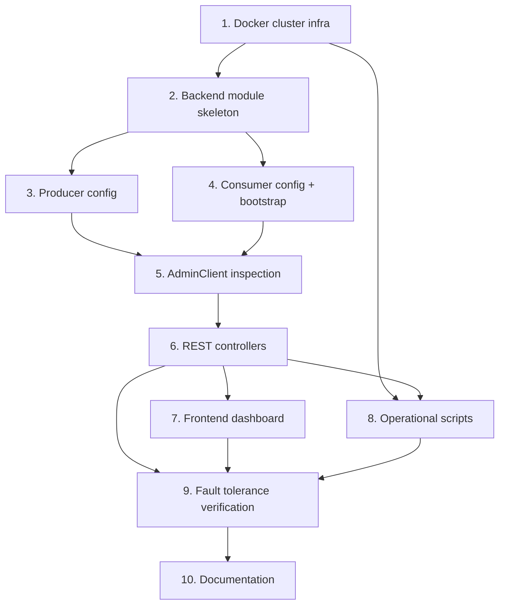

# Implementation Plan: Kafka Cluster (Multi-Broker Upgrade)

## Overview

This plan implements the design in `design.md`, satisfying the requirements in `requirements.md`. Tasks build additively on the existing `day2/streamsocial-kafka/` project (backend-java `com.streamsocial.eventtaxonomy`, Vite/React frontend) without modifying the existing single-broker stack. Work proceeds bottom-up: infrastructure first, then backend producer/consumer config, then REST APIs, then frontend dashboard, then operational scripts and fault-tolerance verification.

## Task Dependency Graph



```json
{
  "waves": [
    { "wave": 1, "tasks": ["1"] },
    { "wave": 2, "tasks": ["2"] },
    { "wave": 3, "tasks": ["3", "4"] },
    { "wave": 4, "tasks": ["5"] },
    { "wave": 5, "tasks": ["6"] },
    { "wave": 6, "tasks": ["7", "8"] },
    { "wave": 7, "tasks": ["9"] },
    { "wave": 8, "tasks": ["10"] }
  ]
}
```

## Tasks

- [x] 1. Create 3-broker Docker cluster infrastructure
  - Create `day2/streamsocial-kafka/docker-compose-cluster.yml` with 1 zookeeper + `kafka-broker-1/2/3` + kafdrop services
  - Configure each broker's `KAFKA_BROKER_ID` (1/2/3), `KAFKA_DEFAULT_REPLICATION_FACTOR=3`, `KAFKA_MIN_INSYNC_REPLICAS=2`, advertised listeners (`localhost:9092/9093/9094`), and thread/buffer tuning (`num.network.threads=8`, `num.io.threads=16`, `socket.send.buffer.bytes=102400`, `socket.receive.buffer.bytes=102400`)
  - Configure kafdrop to connect to all 3 brokers
  - Verify with `docker-compose -f docker-compose-cluster.yml up -d`, wait 45s, then confirm all 4 containers are healthy via `docker ps`
  - _Requirements: 1.1, 1.2, 1.3, 1.4, 1.5, 1.6, 1.7, 1.8_

- [x] 2. Set up cluster-scoped backend module skeleton
  - Create package `com.streamsocial.eventtaxonomy.cluster` (config, consumer, controller, dto sub-packages) under `backend-java/src/main/java`
  - Add `application-cluster.properties` profile binding `server.port=8000` and cluster bootstrap-servers, mirroring the existing `application-kafka.properties` pattern
  - _Requirements: 4.9_

- [x] 3. Implement cluster producer configuration
  - [x] 3.1 Create `ClusterProducerConfig` with `ProducerFactory`/`KafkaTemplate` beans (bootstrap-servers = 3 brokers, `acks=all`, `retries=10`)
    - _Requirements: 2.1, 2.2_
  - [x] 3.2 Register `NewTopic` beans for `user_action`, `content_interaction`, `system_event` with 9 partitions and replication factor 3
    - _Requirements: 2.3_
  - [x] 3.3 Write unit test verifying producer factory config values (bootstrap-servers, acks, retries) and topic bean partition/RF values
    - _Requirements: 2.1, 2.2, 2.3_
  - [x] 3.4 Write property-based test for Property 6 (idempotent topic provisioning): for repeated `ensureTopic` calls, partition/replication settings never change after first creation
    - _Requirements: 1.1, 2.3_

- [x] 4. Implement cluster consumer configuration and bootstrap
  - [x] 4.1 Create `ClusterConsumerConfig` with `ConsumerFactory` bean (bootstrap-servers = 3 brokers, `group-id=streamsocial-cluster-consumers`, `auto-offset-reset=latest`, `enable-auto-commit=true`)
    - _Requirements: 3.1_
  - [x] 4.2 Create `ConsumerStatsRegistry` in-memory component tracking per-consumer assigned partitions and consumed record counts
    - _Requirements: 3.3, 4.5_
  - [x] 4.3 Create `ConsumerBootstrap` starting 3 named consumer containers (`consumer-0/1/2`) on `ApplicationReadyEvent`
    - _Requirements: 3.2_
  - [x] 4.4 Write unit test asserting exactly 3 containers are created with distinct client/bean names on startup
    - _Requirements: 3.2_
  - [x] 4.5 Write property-based test for Property 4 (rebalance completeness): for randomly generated sets of "alive" consumer instances (1-3 of them), the sum of assigned partitions across alive instances equals total subscribed partition count
    - _Requirements: 3.3, 3.4, 6.3_

- [x] 5. Implement AdminClient-backed cluster inspection
  - [x] 5.1 Create `AdminClient` bean scoped to the cluster bootstrap-servers
    - _Requirements: 4.1_
  - [x] 5.2 Implement `ClusterInspector` (health/metadata/consumerStats) using `describeCluster()`, `describeTopics()`, `describeConsumerGroups()`
    - _Requirements: 4.1, 4.4, 4.5_
  - [x] 5.3 Write unit test for health derivation across brokerCount = 0, 1, 2, 3 (mocked AdminClient)
    - _Requirements: 4.2_
  - [x] 5.4 Write property-based test for Property 3 (health status derivation): for any generated brokerCount in [0, 10], status == "healthy" iff brokerCount >= 2
    - _Requirements: 4.2, 4.3_
  - [x] 5.5 Write unit test for timeout/exception handling in health check returning degraded/zero state instead of throwing
    - _Requirements: 4.3_

- [ ] 6. Implement cluster REST controllers
  - [x] 6.1 Implement `ClusterHealthController` (`GET /cluster/health`)
    - _Requirements: 4.1, 4.2, 4.3_
  - [x] 6.2 Implement `ClusterMetadataController` (`GET /cluster/metadata`)
    - _Requirements: 4.4_
  - [x] 6.3 Implement `ConsumerStatsController` (`GET /consumers/stats`)
    - _Requirements: 4.5_
  - [x] 6.4 Implement `FailureSimulationController` (`POST /cluster/simulate-failure`) with broker-name validation regex `^kafka-broker-[1-3]$` and `ProcessBuilder`-based `docker stop`
    - _Requirements: 4.6, 4.7_
  - [x] 6.5 Write property-based test for Property 5 (failure simulation validation): for any generated string input as `broker_name`, the controller returns 400 and never invokes the process launcher unless the input matches `^kafka-broker-[1-3]$`
    - _Requirements: 4.6, 4.7_
  - [x] 6.6 Implement/extend `EventController` with `POST /events/user/register` producing via the cluster `KafkaTemplate`
    - _Requirements: 4.8_
  - [x] 6.7 Write integration test exercising all 4 controllers against a local/mocked cluster context
    - _Requirements: 4.1, 4.4, 4.5, 4.6, 4.7, 4.8, 4.9_

- [ ] 7. Implement frontend cluster dashboard components
  - [~] 7.1 Create `frontend/src/components/cluster/BrokerStatusGrid.jsx` polling `/cluster/health` and `/cluster/metadata`
    - _Requirements: 5.1_
  - [~] 7.2 Create `frontend/src/components/cluster/ConsumerLoadChart.jsx` polling `/consumers/stats`
    - _Requirements: 5.2_
  - [~] 7.3 Create `frontend/src/components/cluster/PartitionLeadershipMonitor.jsx` rendering `/cluster/metadata` partition leader info
    - _Requirements: 5.3_
  - [~] 7.4 Create `frontend/src/components/cluster/FaultToleranceControls.jsx` with per-broker buttons POSTing to `/cluster/simulate-failure`
    - _Requirements: 5.4, 5.5_
  - [~] 7.5 Wire new components into `App.jsx` (or a new `ClusterDashboardTab`) alongside existing `EventDashboard`/`EventPublisher`, with polling error handling that preserves last-known state
    - _Requirements: 5.6_

- [ ] 8. Implement operational scripts
  - [~] 8.1 Create `start_cluster.sh` (and `start_cluster.bat` if parity with existing `.bat` scripts is desired): compose up, 45s wait, backend start on port 8000, readiness polling
    - _Requirements: 7.1, 7.4_
  - [~] 8.2 Create `stop_cluster.sh` (and `.bat` if applicable): stop backend process, compose down
    - _Requirements: 7.3, 7.4_
  - [~] 8.3 Create `verify_cluster.sh` implementing the 3-step check: `curl /cluster/health`, `POST /events/user/register`, `curl /consumers/stats`
    - _Requirements: 7.2_

- [ ] 9. Fault tolerance test verification
  - [~] 9.1 Write integration/manual test script exercising: healthy baseline check, `docker stop kafka-broker-2`, degraded health check within 30s, produce/consume continues, `kafka-topics --describe` and `kafka-consumer-groups --describe` checks, broker restart, health returns to brokerCount=3
    - _Requirements: 6.1, 6.2, 6.3, 6.4, 6.5, 6.6_
  - [~] 9.2 Write property-based test for Property 1 (replication durability): for generated partition metadata samples, replicas.size() == 3 and, when cluster healthy, inSyncReplicas.size() >= 2
    - _Requirements: 1.3, 2.3_
  - [~] 9.3 Write property-based test for Property 2 (acknowledgment safety): simulate producer send outcomes across varying available-ISR counts and assert success only when ISR count >= min.insync.replicas
    - _Requirements: 2.2, 2.4_

- [ ] 10. Documentation and out-of-scope note
  - [~] 10.1 Add a README/README section in `day2/streamsocial-kafka/` documenting the cluster feature, start/stop/verify scripts, and explicitly noting the 5-broker rack-aware scenario as a future/out-of-scope stretch exercise
    - _Requirements: 9.1, 9.2, 9.3_

## Notes

- Tasks 3.4, 4.5, 5.4, 6.5, 9.2, 9.3 are property-based tests validating the correctness properties defined in `design.md`. Use jqwik (or an equivalent QuickCheck-style library) integrated with JUnit 5, per the design's Testing Strategy section.
- Port 8000 is authoritative for this feature's backend; the existing single-broker backend on port 8080 (`day2/streamsocial-kafka` default/`kafka` profile) is untouched.
- The 5-broker rack-aware scenario (task 10.1 note) is documentation-only in this plan; no implementation tasks are included for it, consistent with Requirement 9 (out of scope).
